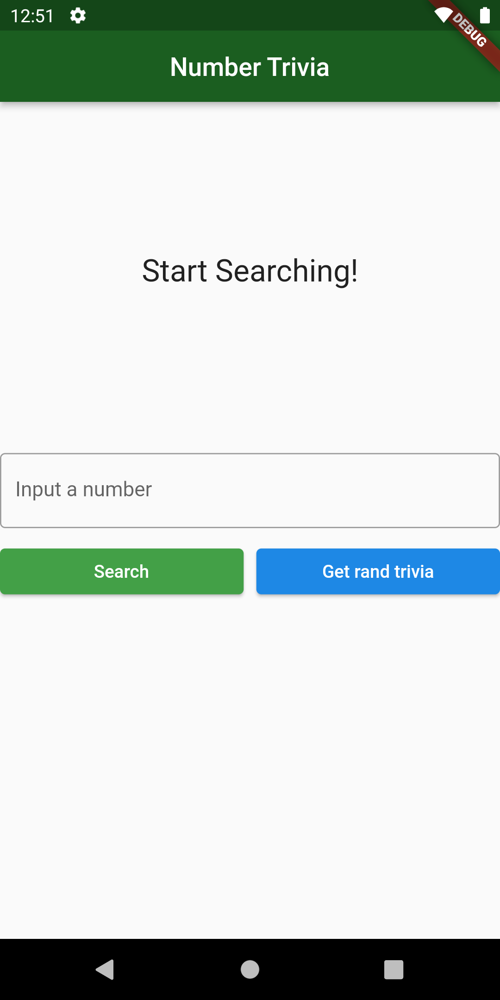
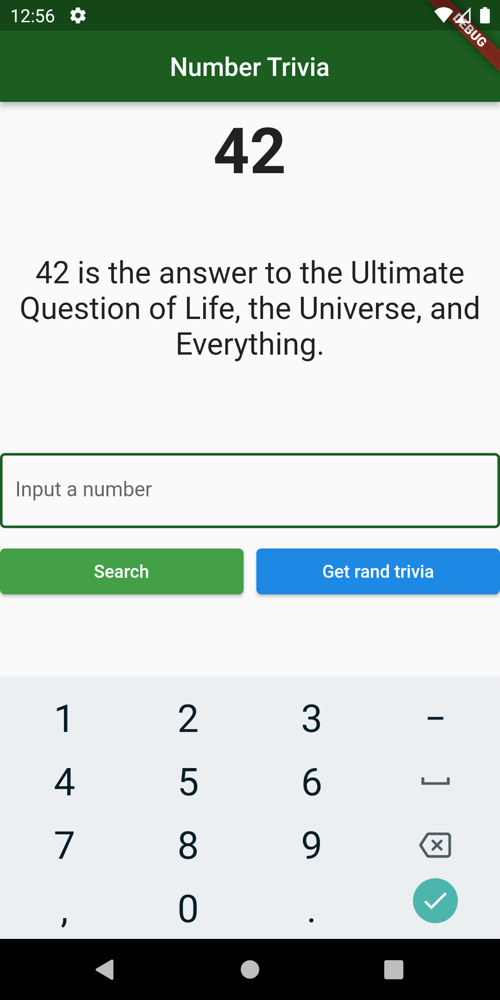

# flutter_architecture_tdd_resocoder

This is my version of the Reso Coder Flutter Clean Architecture with TDD.

Since the original video was released in nov/2020, many features were deprecated, so I updated this course to null safety and latest packages.

## App

A simple trivia app that gets some trivia information for the given or random number.

### Original Source Code

[Learn Flutter Clean Architecture & TDD - Full Course (Flutter Tutorial)](https://www.youtube.com/watch?v=dc3B_mMrZ-Q) 

